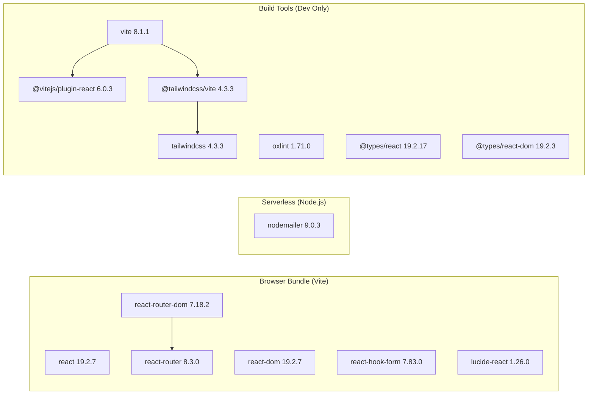
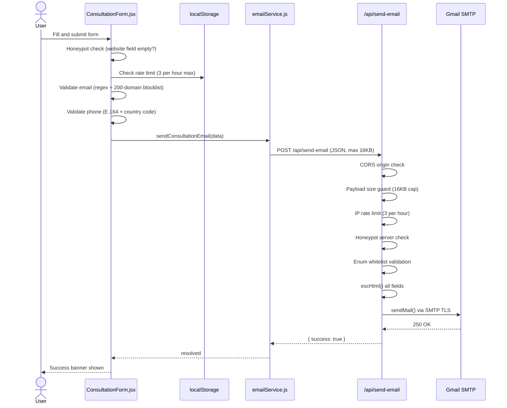
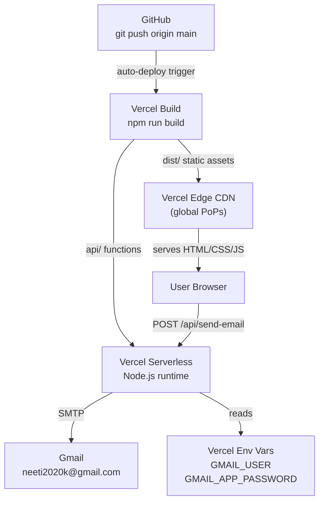

# Neeti Nutrition — Project Dependency Graph

> Generated: 2026-07-29  
> Stack: React 19 · Vite 8 · Tailwind 4 · Vercel Serverless

---

## 1. Full Module Dependency Graph

```mermaid
graph TD
    %% ── Entry Points ──────────────────────────────────────────
    HTML["📄 index.html\n(entry point)"]
    MAIN["📄 src/main.jsx"]
    API["⚡ api/send-email.js\n(Vercel Serverless)"]

    %% ── Core App ──────────────────────────────────────────────
    APP["📦 src/App.jsx"]

    %% ── Components ────────────────────────────────────────────
    NAVBAR["🧩 Navbar.jsx"]
    HERO["🧩 HeroSection.jsx"]
    ABOUT["🧩 AboutSection.jsx"]
    SERVICES["🧩 ServicesSection.jsx"]
    CREDS["🧩 CredentialsSection.jsx"]
    FORM["🧩 ConsultationForm.jsx"]
    FOOTER["🧩 Footer.jsx"]

    %% ── Services ──────────────────────────────────────────────
    EMAILSVC["🔧 src/services/emailService.js"]

    %% ── Styles ────────────────────────────────────────────────
    CSS["🎨 src/index.css"]

    %% ── npm: Runtime dependencies ─────────────────────────────
    REACT["📦 react ^19.2.7"]
    REACTDOM["📦 react-dom ^19.2.7"]
    REACTROUTER["📦 react-router-dom ^7.18.2"]
    RHF["📦 react-hook-form ^7.83.0"]
    LUCIDE["📦 lucide-react ^1.26.0"]
    NODEMAILER["📦 nodemailer ^9.0.3"]

    %% ── npm: Dev / Build tools ────────────────────────────────
    VITE["🔧 vite ^8.1.1"]
    VITEREACT["🔧 @vitejs/plugin-react ^6.0.3"]
    TW["🔧 tailwindcss ^4.3.3"]
    TWVITE["🔧 @tailwindcss/vite ^4.3.3"]
    OXLINT["🔧 oxlint ^1.71.0"]

    %% ── Infrastructure ────────────────────────────────────────
    VERCEL["☁️ Vercel\n(CDN + Serverless)"]
    GMAIL["📧 Gmail SMTP\n(nodemailer relay)"]
    GFONTS["🔤 Google Fonts\n(Inter + Playfair Display)"]

    %% ── Entry point flow ──────────────────────────────────────
    HTML --> MAIN
    HTML --> GFONTS

    %% ── main.jsx wires ────────────────────────────────────────
    MAIN --> REACT
    MAIN --> REACTDOM
    MAIN --> REACTROUTER
    MAIN --> APP
    MAIN --> CSS

    %% ── App.jsx wires ─────────────────────────────────────────
    APP --> NAVBAR
    APP --> HERO
    APP --> ABOUT
    APP --> SERVICES
    APP --> CREDS
    APP --> FORM
    APP --> FOOTER

    %% ── Component -> npm packages ─────────────────────────────
    NAVBAR --> REACT
    NAVBAR --> LUCIDE

    HERO --> REACT
    HERO --> LUCIDE

    ABOUT --> REACT
    ABOUT --> LUCIDE

    SERVICES --> REACT
    SERVICES --> LUCIDE

    CREDS --> REACT
    CREDS --> LUCIDE

    FOOTER --> REACT
    FOOTER --> LUCIDE

    FORM --> REACT
    FORM --> RHF
    FORM --> LUCIDE
    FORM --> EMAILSVC

    %% ── Service layer ─────────────────────────────────────────
    EMAILSVC -->|"POST /api/send-email"| API

    %% ── Serverless API ────────────────────────────────────────
    API --> NODEMAILER
    API -->|"SMTP TLS 465"| GMAIL

    %% ── Build toolchain ───────────────────────────────────────
    VITE --> VITEREACT
    VITE --> TWVITE
    TWVITE --> TW
    CSS --> TW

    %% ── Deployment ────────────────────────────────────────────
    VITE -->|"npm run build -> dist/"| VERCEL
    API --> VERCEL
    VERCEL -->|"serves"| HTML

    %% ── Styling ───────────────────────────────────────────────
    classDef entry     fill:#1e293b,color:#f8fafc,stroke:#475569
    classDef component fill:#064e3b,color:#ecfdf5,stroke:#059669
    classDef service   fill:#7c3aed,color:#f5f3ff,stroke:#6d28d9
    classDef npm_rt    fill:#0369a1,color:#e0f2fe,stroke:#0284c7
    classDef npm_dev   fill:#374151,color:#f9fafb,stroke:#6b7280
    classDef infra     fill:#92400e,color:#fffbeb,stroke:#b45309

    class HTML,MAIN,API entry
    class APP,NAVBAR,HERO,ABOUT,SERVICES,CREDS,FORM,FOOTER component
    class EMAILSVC service
    class REACT,REACTDOM,REACTROUTER,RHF,LUCIDE,NODEMAILER npm_rt
    class VITE,VITEREACT,TW,TWVITE,OXLINT npm_dev
    class VERCEL,GMAIL,GFONTS infra
```

---

## 2. Per-File Import Table

| File | Internal Imports | npm Packages |
|------|-----------------|--------------|
| `src/main.jsx` | `./App.jsx`, `./index.css` | `react`, `react-dom/client`, `react-router-dom` |
| `src/App.jsx` | `Navbar`, `HeroSection`, `AboutSection`, `ServicesSection`, `CredentialsSection`, `ConsultationForm`, `Footer` | — |
| `src/components/Navbar.jsx` | — | `react` (useState, useEffect), `lucide-react` (Menu, X, Leaf, Phone) |
| `src/components/HeroSection.jsx` | — | `lucide-react` (ArrowDown, Star, Award, Users, Clock) |
| `src/components/AboutSection.jsx` | — | `lucide-react` (Heart, Stethoscope, BookOpen, Leaf) |
| `src/components/ServicesSection.jsx` | — | `lucide-react` (Activity, Baby, Scale, Brain, Dumbbell, Heart, Stethoscope, Users) |
| `src/components/CredentialsSection.jsx` | — | `lucide-react` (GraduationCap, Briefcase, Award, CheckCircle2) |
| `src/components/ConsultationForm.jsx` | `../services/emailService` | `react` (useState, useEffect, useRef), `react-hook-form`, `lucide-react` (Send, CheckCircle, AlertCircle, User, Mail, Phone, Calendar, MessageSquare) |
| `src/services/emailService.js` | — | — (pure fetch API, no npm imports) |
| `api/send-email.js` | — | `nodemailer` |

---

## 3. Runtime Dependency Tree

---

## 4. Data Flow — Form Submission

---

## 5. Deployment Architecture

---

## 6. Security Layer Map

| Layer | Mechanism | Location |
|-------|-----------|----------|
| Transport | HSTS max-age=63072000 | `vercel.json` headers |
| Clickjacking | X-Frame-Options: DENY | `vercel.json` headers |
| MIME sniffing | X-Content-Type-Options: nosniff | `vercel.json` headers |
| Script injection | Content-Security-Policy | `vercel.json` headers |
| Input validation | Email regex + 200-domain blocklist | `ConsultationForm.jsx` |
| Input validation | E.164 phone format | `ConsultationForm.jsx` |
| Anti-bot (client) | Honeypot website field | `ConsultationForm.jsx` |
| Anti-bot (server) | Honeypot check | `api/send-email.js` |
| Rate limiting (client) | localStorage 3/hr + countdown UI | `ConsultationForm.jsx` |
| Rate limiting (server) | In-memory IP Map 3/hr | `api/send-email.js` |
| CORS | Origin whitelist neetikayastha.com.np | `api/send-email.js` |
| Payload DoS | 16 KB Content-Length cap | `api/send-email.js` |
| HTML injection | escHtml() on all email fields | `api/send-email.js` |
| Enum injection | Whitelist for consultationType and healthGoal | `api/send-email.js` |
| Secret management | Env vars only in Vercel dashboard | process.env |
| Bot crawlers | Disallow /api/ | `public/robots.txt` |
